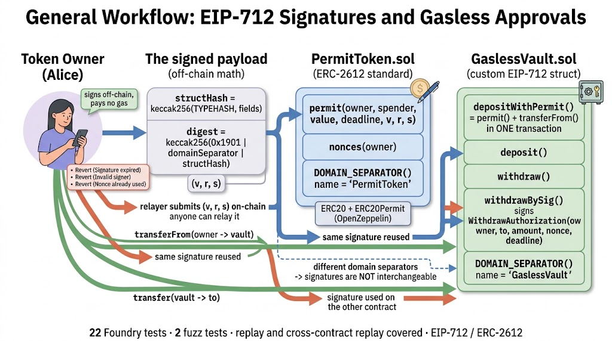

<div align="center">
  <h1>🔏 EIP-712 Signatures — Gasless Approvals and Signed Authorizations</h1>
  <p><b>Gasless ERC20 approvals and custom signed vault authorizations, with nonce replay protection and cross-contract domain separation</b></p>
</div>

## 📖 About the Project

**EIP-712 Signatures** is a production-ready Web3 Smart Contract project built with **Solidity** `0.8.30` and thoroughly tested using the **Foundry** framework. It implements the two halves of the standard side by side: an ERC20 with **ERC-2612 `permit`** for gasless approvals, and a vault that accepts a **custom EIP-712 typed authorization** for gasless withdrawals — the part of the standard that most integrations never get past.

The difference matters in production. `permit` removes the two-transaction `approve` + `transferFrom` dance and lets a relayer pay the gas, while a custom struct is what you need when the thing being authorized is not an allowance but a protocol-specific action. Both flows are shown with the full signing pipeline visible — type hash, struct hash, domain separator, digest and recovery — so the reader can see exactly which bytes are signed and why the same signature cannot be replayed on another contract or another chain.

**Key Technical Highlights:**
* **Solidity `0.8.30`:** Custom errors on every guard, immutables for the token reference and no admin surface once deployed.
* **OpenZeppelin building blocks:** `ERC20Permit` for ERC-2612, and `EIP712`, `ECDSA` and `Nonces` composed by hand for the custom authorization.
* **Custom type hash:** `WITHDRAW_TYPEHASH` defines `WithdrawAuthorization(address owner,address to,uint256 amount,uint256 nonce,uint256 deadline)`.
* **Foundry Framework:** A 22-case suite that includes 2 fuzz tests and explicit replay, reused-signature and cross-contract replay attacks.
* **Domain separation:** The token and the vault derive different domain separators from their own name and address, which is what stops a signature from being valid on both.

---

## ⚙️ How It Works

Every EIP-712 signature commits to three things: the **struct** being authorized, the **domain** it belongs to, and a **nonce**. The struct is described by a type string — `Permit(address owner,address spender,uint256 value,uint256 nonce,uint256 deadline)` for ERC-2612, and the vault's own `WithdrawAuthorization(address owner,address to,uint256 amount,uint256 nonce,uint256 deadline)` — and its hash is built with `keccak256(abi.encode(TYPEHASH, ...fields))`. OpenZeppelin's `_hashTypedDataV4` then wraps it as `keccak256("\x19\x01" || domainSeparator || structHash)`, and `ECDSA.recover` turns the `v, r, s` values back into a signer address that must equal the expected owner.

`PermitToken` inherits `ERC20` and `ERC20Permit` and adds nothing on top of them: the constructor mints the whole supply to the deployer and the token name doubles as the EIP-712 domain name. `permit(owner, spender, value, deadline, v, r, s)` sets the allowance from a signature, `nonces(owner)` exposes the per-address counter that makes each signature single-use, and `DOMAIN_SEPARATOR()` exposes the domain hash. Because the signature carries a `value` and a `deadline`, the owner can authorize an exact amount that expires, instead of granting an unlimited allowance that lives forever.

`GaslessVault` reimplements that pipeline with its own type. It holds a per-depositor balance and offers two paths for each direction. Deposits can be direct (`deposit`, requires a prior approval) or gasless (`depositWithPermit`, which calls `permit` and then `transferFrom` in the same transaction, so a relayer does both jobs with one transaction from the user's point of view). Withdrawals can be direct (`withdraw`, called by the depositor) or gasless (`withdrawBySig`, where the depositor signs an authorization and anyone submits it).

The vault's domain is deliberately different from the token's: `EIP712("GaslessVault", "1")` against the token's own name, plus a different `verifyingContract` address. That is why a signature produced for the token is rejected by the vault and vice versa — the test suite proves both directions, and also proves that a `WithdrawAuthorization` cannot be smuggled in as a `Permit`. Nonces come from OpenZeppelin's `Nonces` and are consumed with `_useNonce(owner)`, which reads and increments atomically, so the same signature cannot be replayed even inside the same block.

### Architecture Diagram



### Core Component File Paths

[PermitToken.sol](./src/PermitToken.sol) - ERC20 with ERC-2612 `permit` for gasless approvals

[GaslessVault.sol](./src/GaslessVault.sol) - Vault with direct and signature-authorized deposits and withdrawals

[EIP712Test.t.sol](./test/EIP712Test.t.sol) - Full signing flow, replay attacks, domain separation and fuzz tests

## 💻 Technical Docs

The primary interaction points are the `PermitToken` constructor (which fixes the domain), `depositWithPermit` (gasless deposit), `withdraw` (direct exit) and `withdrawBySig` (the custom EIP-712 authorization).

### PermitToken (constructor)
File: src/PermitToken.sol

```Solidity
    constructor(
        string memory _name,
        string memory _symbol,
        uint256 _initialSupply
    )
        ERC20(_name, _symbol)
        ERC20Permit(_name)
    {
        _mint(msg.sender, _initialSupply);
    }
```

### depositWithPermit
File: src/GaslessVault.sol

```Solidity
    function depositWithPermit(
        address owner,
        uint256 amount,
        uint256 deadline,
        uint8 v,
        bytes32 r,
        bytes32 s
    ) external {
        if (amount == 0) revert ZeroAmount();

        // Step 1: Use the permit signature to approve this vault
        i_token.permit(owner, address(this), amount, deadline, v, r, s);

        // Step 2: Transfer tokens from owner to vault
        s_vaultBalanceOf[owner] += amount;
        i_token.transferFrom(owner, address(this), amount);

        emit Deposited(owner, amount);
    }
```

### withdraw
File: src/GaslessVault.sol

```Solidity
    function withdraw(address to, uint256 amount) external {
        if (amount == 0) revert ZeroAmount();
        if (s_vaultBalanceOf[msg.sender] < amount) revert InsufficientVaultBalance();

        s_vaultBalanceOf[msg.sender] -= amount;
        i_token.transfer(to, amount);

        emit Withdrawn(msg.sender, to, amount);
    }
```

### withdrawBySig
File: src/GaslessVault.sol

```Solidity
    function withdrawBySig(
        address owner,
        address to,
        uint256 amount,
        uint256 deadline,
        uint8 v,
        bytes32 r,
        bytes32 s
    ) external {
        // Check: deadline
        if (block.timestamp > deadline) revert DeadlineExpired();
        if (amount == 0) revert ZeroAmount();
        if (s_vaultBalanceOf[owner] < amount) revert InsufficientVaultBalance();

        // Step 1: Build the struct hash for WithdrawAuthorization
        // _useNonce atomically reads AND increments the nonce (from OZ Nonces)
        bytes32 structHash = keccak256(
            abi.encode(
                WITHDRAW_TYPEHASH,
                owner,
                to,
                amount,
                _useNonce(owner),
                deadline
            )
        );

        // Step 2: Compute EIP-712 digest (OZ handles "\x19\x01" prefix + domain separator)
        bytes32 digest = _hashTypedDataV4(structHash);

        // Step 3: Recover signer and verify (OZ ECDSA handles malleability checks)
        address signer = ECDSA.recover(digest, v, r, s);
        if (signer != owner) revert InvalidWithdrawSignature();

        // Effects: update balance (nonce already incremented by _useNonce)
        s_vaultBalanceOf[owner] -= amount;

        // Interaction: transfer tokens
        i_token.transfer(to, amount);

        emit Withdrawn(owner, to, amount);
    }
```

## 🚀 Execution Example

Here is a step-by-step example of the flow the suite exercises, with the values it actually uses.

- Step 1: Deploy and fund
The owner deploys `PermitToken("PermitToken", "PTK", 1_000_000e18)` and then `GaslessVault(token)`, so the vault is bound to that token forever. Alice (derived from the test private key `0xA11CE`) receives `10,000 PTK`, and the token name `PermitToken` becomes the EIP-712 domain name for every `permit` signature.

- Step 2: Sign off-chain
Alice signs the ERC-2612 `Permit` struct with `spender = vault`, `value = amount`, her current nonce (`0` for the first signature) and a `deadline`. Wallets that support EIP-712 display those exact fields to the user before signing. Her `v, r, s` are the only thing that travels on-chain.

- Step 3: Gasless deposit
A relayer calls `depositWithPermit(alice, amount, deadline, v, r, s)`. Inside, the vault calls `token.permit(...)`, which verifies the digest, checks the deadline and the nonce, and sets the allowance to the vault. The same transaction then pulls the tokens with `transferFrom` and credits `s_vaultBalanceOf[alice]`. Alice paid no gas and sent no transaction; the test runs this from a dedicated `relayer` address to prove it.

- Step 4: Direct paths
`deposit(amount)` does the same as step 3 but needs a prior `approve`, and `withdraw(to, amount)` takes `to` as a parameter so a depositor can send the tokens elsewhere. Both revert with `ZeroAmount()` on a zero amount, and withdrawals revert with `InsufficientVaultBalance()` above the stored balance.

- Step 5: Gasless withdrawal with a custom struct
Alice signs a `WithdrawAuthorization(owner, to, amount, nonce, deadline)` instead of a permit. A relayer submits `withdrawBySig(...)`: the vault rebuilds the struct hash with the next nonce, computes the digest through `_hashTypedDataV4`, recovers the signer with `ECDSA.recover` and requires it to equal `owner`. The balance is decremented before the transfer, and the nonce was already consumed by `_useNonce`.

- Step 6: Replay protection
Every signature consumes one nonce. Reusing the same `Permit` reverts, and the same is true for `WithdrawAuthorization`: the tests assert both, and `test_replayBlockedByNonce` shows that nonce `n` cannot be spent twice.

- Step 7: Domain separation
The token's domain separator and the vault's are different, even though both are computed with the same standard: different names (`PermitToken` vs `GaslessVault`) and different verifying contracts. `test_signatureNotReplayableAcrossContracts` and `test_withdrawSigCannotBeUsedAsPermit` prove that a signature valid in one contract is rejected by the other, in both directions.

- Step 8: Fuzzing
Two fuzz tests close the suite: `test_fuzz_randomSignerCannotForgePermit` checks that an arbitrary signer cannot produce a valid permit for Alice, and `test_fuzz_permitWorksForAnyAmountAndDeadline` checks that any amount and deadline the fuzzer throws at it still round-trips correctly.

## ⬆️ Installation

Two dependencies are wired as git submodules: `forge-std` and `openzeppelin-contracts`.

```Bash
git clone --recursive https://github.com/k2gutierrez/EIP712-Signatures.git
cd EIP712-signatures
forge build
```

## 🧪 Testing

`test/EIP712Test.t.sol` is a 22-case suite that runs entirely in-process — no fork or RPC endpoint is required. It verifies the EIP-712 fundamentals (domain separator composition, both type hashes), the complete permit flow including nonce increments, expired deadlines, wrong signers and reused signatures, the gasless deposit through a relayer, the custom withdrawal authorization, cross-contract replay rejection, insufficient-balance guards, and two fuzz tests.

Testing command:
```Bash
forge test -vvv
```

> ⚠️ The committed CI workflow runs `forge fmt --check` and currently fails, because the source files are not formatted to `forge fmt` defaults. Running `forge fmt` fixes it; `forge test` itself passes as-is.

## 📊 Coverage

```Bash
forge coverage
```
